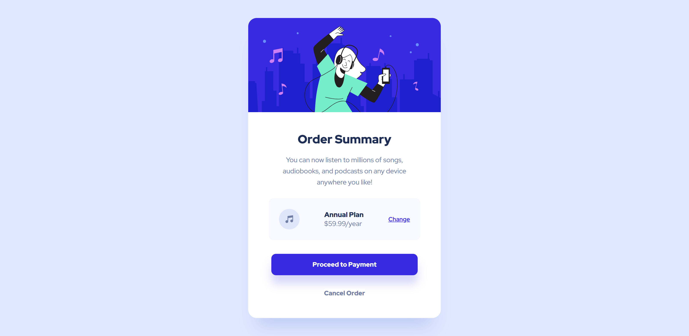
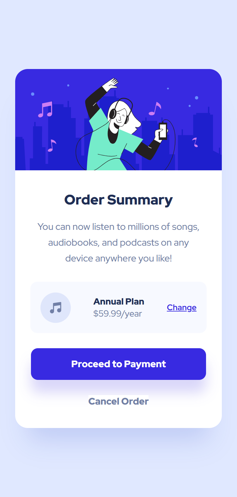

# Frontend Mentor - Order Summary Card Solution

This is a solution to the [Order Summary Card challenge on Frontend Mentor](https://www.frontendmentor.io/challenges/order-summary-component-QlPmajDUj). Frontend Mentor challenges help you improve your coding skills by building realistic projects. This solution features a clean, mobile-first design with interactive elements like buttons and hover states.

## Table of contents

- [Overview](#overview)
  - [The challenge](#the-challenge)
  - [Screenshot](#screenshot)
  - [Links](#links)
  - [Features](#Features)
  - [Installation](#Installation)
- [My process](#my-process)
  - [Built with](#built-with)
  - [What I learned](#what-i-learned)
  - [Continued development](#continued-development)
  - [Useful resources](#useful-resources)
- [Author](#author)
- [Acknowledgments](#acknowledgments)

## Overview

### The challenge

Users should be able to:

- View an order summary card with information about a user's subscription.
- See pricing details and have the option to change the plan.
- Have buttons like "Proceed to Payment" and "Cancel Order" that are interactive with hover and active states.
- The design should be responsive and adapt to different screen sizes (mobile-first approach).

### Screenshot




### Links

- Solution URL: [solution URL](https://github.com/nishanth1596/Order-summary-component)
- Live Site URL: [live site URL](https://nishanth-order-submit-component.netlify.app/)

### Features

- **Responsive Design**: The card layout adapts seamlessly from mobile to desktop view.
- **Hover States**: Buttons and links feature hover and active states for better user interactivity.
- **Dynamic Content**: Components are reusable, making it easy to extend the functionality or update the content.

### Installation

To run this project locally:

1. Clone this repository:

   ```bash
   git clone https://github.com/yourusername/order-summary-card.git
   ```

2. Navigate into the project directory:
   cd order-summary-card

3. Install dependencies:
   npm install

4. Start the development server:
   npm start

5. Open the project in your browser at http://localhost:3000.

## Usage

- This project is a simple order summary card that can be integrated into any e-commerce or subscription platform. The card displays information about an order, along with a payment button and a cancel button.

## My process

### Built with

- React.js for building the interactive user interface.
- JSX (React syntax) for component structure and rendering.
- CSS Modules for scoped styling of each component (e.g., Card, PaymentButton, Plan).
- CSS custom properties (variables) for consistent theming and color management.
- Flexbox for layout and responsive design.
- Mobile-first approach to ensure a great experience on all screen sizes.

### What I learned

Through this project, I improved my skills in:

1. **React Component Structure**: I built the application using small, reusable components like `Card`, `PaymentButton`, and `Plan`, which made it easy to manage the UI and its functionality.

   Example:

   ```js
   function Card() {
     return (
       <article className={styles.article}>
         
         <div className={styles.info}>
           <h1 className={styles.heading}>Order Summary</h1>
           <p className={styles.details}>
             You can now listen to millions of songs...
           </p>
         </div>
         <Plan />
         <PaymentButton />
       </article>
     );
   }
   ```

2. **CSS Modules**: I used CSS Modules to scope styles locally for each component, preventing any style clashes across the app. Each component has its own dedicated style file (e.g., Card.module.css, PaymentButton.module.css), making it easier to maintain.

3. **Hover and Active States**: I implemented hover and active states for buttons, improving user interactivity.

4. **Responsive Design:**: I used a mobile-first design approach, utilizing Flexbox for layout adjustments. I also ensured that the card adapts well to various screen sizes, especially for tablet and desktop views.

5. **Reusable Components**:The use of reusable components like PaymentButton and Plan helped me separate concerns and make the app more modular. Each component handles a specific part of the interface, making future changes easier

### Continued development

Since this is a small project, I didn't create too many components, but for larger projects, I plan to create multiple components and use props to make them more reusable. I would also like to continue practicing more complex layout techniques, especially working with Flexbox and Grid

### Useful resources

MDN Web Docs - Flexbox - This documentation helped me understand Flexbox better.
Google Fonts - I used the Outfit font from Google Fonts to style the text.

### Author

- Name: Nishanth
- Website - [My GitHub Profile](https://github.com/nishanth1596)
- Frontend Mentor - [@nishanth1596](https://www.frontendmentor.io/profile/nishanth1596)
- Twitter - [@nishanth1596](https://x.com/nishanth1596)

### Acknowledgments

A special thanks to the Frontend Mentor community for providing inspiration and feedback on this project. The resources provided by the platform were very helpful in getting me to the solution.
